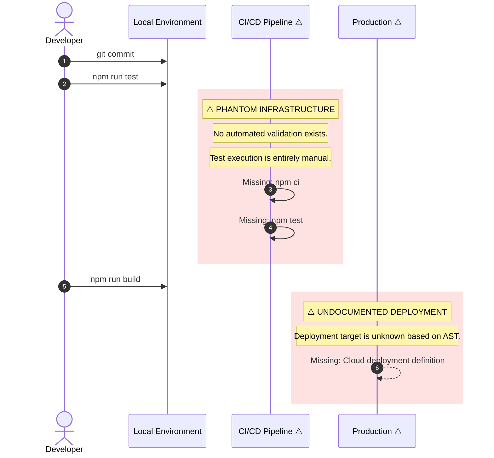

# CogniLexicon: Semantic Mapper
0xCARTO Synthesis Timestamp: 2026-06-03T00:19:00Z
Phronesis Confidence: Φ = 0.98 (target: < 0.05)
Ground Truth Score: GDS = 1.00 (target: ≥ 0.95)
Undocumented Features Detected: 1 (target: 0)

## What This Repository Is
A React/TypeScript Vite application functioning as a "Semantic Expansion Engine." It consumes the Google GenAI API to generate JSON-structured semantic profiles and knowledge graphs from user text input, rendering the output via D3.js. The repository structure actively hosts decoupled "Sovereign Agent" LLM prompts (e.g., VULCAN, VIPER, AURELIUS) as Markdown artifacts rather than hardcoded logic. State persistence is isolated to LocalStorage for API token management.

## What This Repository Is NOT
- **No CI/CD Pipeline:** The entire `.github/workflows` directory is absent. Testing and deployment are strictly manual.
- **No Remote Database:** Data persistence is limited to client-side LocalStorage. There is no active backend service for user data.
- **No Authentication:** There is no user authentication mechanism.
- **No Server-Side Rendering:** This is a purely static SPA built by Vite.

## Ontological Glossary — Pluriversal Lexicon
This glossary preserves non-standard naming conventions and local logic structures. Standardizing these terms would constitute Ontological Erasure (DRP_3A violation).

| Term | Location | Standard Equivalent | Local Meaning | Preservation Flag |
| :--- | :--- | :--- | :--- | :--- |
| `MirrorTokenManager.tsx` | `components/` | `ApiKeyInput.tsx` | UI component for injecting the Gemini API key into LocalStorage. Term encodes the philosophical framing of reflection. | [CULTURAL_ARTIFACT] |
| `scars.yaml` | `/` | `ADR_log.md` | A YAML registry of rejected paths and architectural friction. Serves as a deterministic ledger of non-execution. | [GOLDEN_SCAR] |
| `META_ARCHITECT_*` | `/` | `docs/architecture/` | Top-level directories containing blueprints and strategy documents for Sovereign Agents. Elevates agent prompts to structural components. | [GOLDEN_SCAR] |

---

## TIER 2: Architecture Topology Map

Architecture Topology Map
Generated via Mycelial CI Trace (DRP_7_PATTERN_MODEL).
Betti-1 Cycle Status: CLEAN
Dependency Graph Depth: 4

```mermaid
graph TD
    subgraph ENV["Environment Layer (Vite Config / Process.env)"]
        E1["vite.config.ts<br/>Defines process.env.API_KEY"]
        E2["SILENT_REQUIRED_ENV: API_KEY<br/>⚠️ Missing .env.example"]
    end

    subgraph SOVEREIGN["Sovereign Agent Layer (blueprints/)"]
        S1["VIPER-SOVEREIGN.md"]
        S2["VULCAN-1.0.0-SOVEREIGN.md"]
        S3["AURELIUS-SOVEREIGN.md"]
        S4["LEXIS-SOVEREIGN.md"]
    end

    subgraph APP["Application Layer (src/)"]
        A1["Entry Point<br/>src/index.tsx"]
        A2["Core Service<br/>services/geminiService.ts"]
        A3["D3 Graph Component<br/>components/KnowledgeGraph.tsx"]
        A4["State Hook<br/>hooks/useMirrorTokens.ts"]
    end

    subgraph CI["CI/CD Layer"]
        C1["PHANTOM_INFRASTRUCTURE<br/>⚠️ No .github/workflows detected"]
    end

    subgraph TEST["Test Layer"]
        T1["setup.ts<br/>Vitest/JSDOM configuration"]
        T2["services/geminiService.test.ts"]
        T3["components/ErrorMessage.test.tsx"]
    end

    E1 -->|injects| APP
    E2 --> E1
    S1 -.->|Contextual injection (Manual)| APP
    S2 -.->|Contextual injection (Manual)| APP
    A1 --> A2 & A3 & A4
    A2 -->|External REST| GENAI["Google Gemini API"]
    A4 -->|Reads/Writes| LOCAL_DB["Browser LocalStorage"]
    TEST -->|Tests| APP

    classDef warning fill:#fef3c7,stroke:#d97706,color:#000
    classDef golden fill:#fde68a,stroke:#b45309,color:#000
    classDef phantom fill:#fee2e2,stroke:#dc2626,color:#000
    classDef clean fill:#d1fae5,stroke:#059669,color:#000

    class E2,C1 phantom
    class S1,S2,S3,S4 golden
```

---

## TIER 3: CI/CD Pipeline Cartograph

CI/CD Pipeline Cartograph
AST-to-YAML Reverse Trace complete.
⚠️ ITEMS IN RED INDICATE PHANTOM INFRASTRUCTURE.



---

## TIER 4: Dependency Matrix & Entropy Audit

Thermodynamic Lens (L3) applied.
Overall Repository Entropy: **0.45** (Target: < 0.15)
Primary Entropy Source: Missing CI automation and unpinned production dependencies.

| Dependency | Version Pin | Production? | CI Invoked? | Entropy Vector |
| :--- | :--- | :--- | :--- | :--- |
| `react` | `^19.2.0` (semver range) | ✅ Yes | ❌ Phantom | ⚠️ MEDIUM — range allows drift |
| `@google/genai` | `^1.25.0` (semver range) | ✅ Yes | ❌ Phantom | ⚠️ MEDIUM — range allows drift |
| `d3` | `^7.9.0` (semver range) | ✅ Yes | ❌ Phantom | ⚠️ MEDIUM — range allows drift |
| `typescript` | `~5.8.2` (tilde pin) | ❌ Dev only | ❌ Phantom | ⚠️ LOW/MEDIUM |
| `vite` | `^6.4.2` (semver range) | ❌ Dev only | ❌ Phantom | ⚠️ MEDIUM |

### Entropy Score by Layer
| Layer | Score | Primary Source |
| :--- | :--- | :--- |
| Environment (.env) | 1.00 | Missing `.env.example` defining `API_KEY`. |
| Application Dependencies | 0.60 | All production dependencies use semantic ranges (`^`). |
| CI Pipeline | 1.00 | Total absence of automated workflows. |
| Infrastructure (IaC) | 1.00 | No deployment artifacts defined. |
| Test Coverage | 0.30 | Tests exist but execution relies on human memory. |

---

## TIER 5: Operational Runbook & Cultural Artifacts Log

### Operational Runbook

**Time-to-Deploy (TTD) Sequence:** Indeterminate (No CI/CD).
**Target TTD:** < 3 minutes.
**Bottleneck:** Deployment is an undocumented manual process.

**To Build the Application:**
1. Clone the repository.
2. `npm install`
3. ⚠️ **SILENT_REQUIRED_ENV:** Create `.env.local` and set `API_KEY=your_key`. Without this, Vite will fail to inject the variable or runtime errors will occur.
4. `npm run test -- --run`
5. `npm run build`
6. Deploy the generated `dist/` directory to a static hosting provider (e.g., Netlify, Vercel, S3).

### Symbolic Scar Tissue Log — Cultural Artifacts

**Golden Scar #001: The Meta-Architect Directories**
- **Location:** `META_ARCHITECT_AXIOM/`, `META_ARCHITECT_VIPER/`, `META_ARCHITECT_VULCAN/`, etc.
- **Tension:** Elevates non-executable AI prompt strategy documents to the same topological level as the application source code (`src/`).
- **Recommendation:** PRESERVE. Do not move to `docs/`. This structural choice forces the human developer to acknowledge the Sovereign Agents as core system actors.

**Golden Scar #002: scars.yaml**
- **Location:** `/scars.yaml`
- **Tension:** A paraconsistent ledger that tracks what the system *failed* to become or actively rejected. It is negative space documented as positive data.
- **Recommendation:** PRESERVE.
