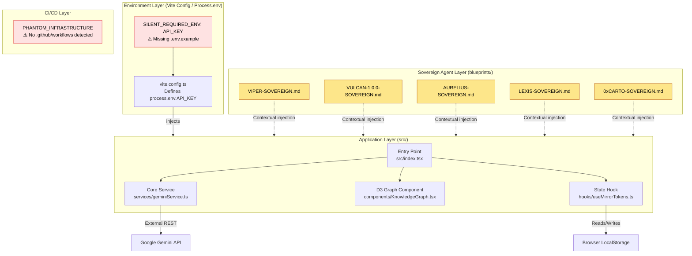

# 0xCARTO Architecture Topology
0xCARTO Synthesis Timestamp: 2026-06-03T00:19:00Z

## MEREOLOGICAL MAP
The repository functions as a decoupled execution environment.

[Component] ∈ [Service] ∈ [Module] ∈ [Root]
[Sovereign Blueprint] ∈ [Agent Layer] ∈ [Root]

## TIER 2: Architecture Topology Map
Generated via Mycelial CI Trace (DRP_7_PATTERN_MODEL).
Betti-1 Cycle Status: CLEAN

## DATA FLOWS
1. User → [UI] → [API] → [UI] → [DB]
2. User → [Agent Blueprint] → [LLM Context] → [Structured Output] → [Scar Ledger Schema]

## DEPENDENCY MATRIX (L3 Thermodynamic Lens)
| Dependency | Version Pin | Production? | CI Invoked? | Entropy Vector |
| :--- | :--- | :--- | :--- | :--- |
| `react` | `^19.2.0` (semver range) | ✅ Yes | ❌ Phantom | ⚠️ MEDIUM — range allows drift |
| `@google/genai` | `^1.25.0` (semver range) | ✅ Yes | ❌ Phantom | ⚠️ MEDIUM — range allows drift |
| `d3` | `^7.9.0` (semver range) | ✅ Yes | ❌ Phantom | ⚠️ MEDIUM — range allows drift |
| `typescript` | `~5.8.2` (tilde pin) | ❌ Dev only | ❌ Phantom | ⚠️ LOW/MEDIUM |
| `vite` | `^6.4.2` (semver range) | ❌ Dev only | ❌ Phantom | ⚠️ MEDIUM |

## RUNBOOK
1. Clone the repository.
2. `npm install`
3. ⚠️ **SILENT_REQUIRED_ENV:** Create `.env.local` and set `API_KEY=your_key`.
4. `npm run test -- --run`
5. `npm run build`
